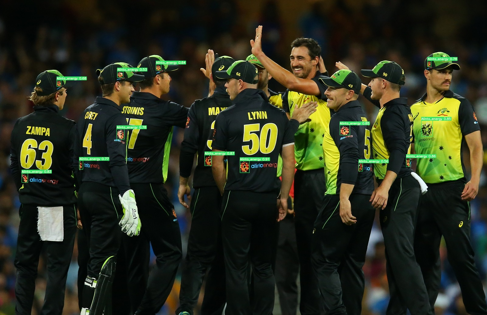

# brand_detection_using-yolov7

## Training

Single GPU training

``` shell
# train p5 models
python train.py --workers 8 --device 0 --batch-size 32 --data data/coco.yaml --img 640 640 --cfg cfg/training/yolov7.yaml --weights '' --name yolov7 --hyp data/hyp.scratch.p5.yaml

# train p6 models
python train_aux.py --workers 8 --device 0 --batch-size 16 --data data/coco.yaml --img 1280 1280 --cfg cfg/training/yolov7-w6.yaml --weights '' --name yolov7-w6 --hyp data/hyp.scratch.p6.yaml
```

Multiple GPU training

``` shell
# train p5 models
python -m torch.distributed.launch --nproc_per_node 4 --master_port 9527 train.py --workers 8 --device 0,1,2,3 --sync-bn --batch-size 128 --data data/coco.yaml --img 640 640 --cfg cfg/training/yolov7.yaml --weights '' --name yolov7 --hyp data/hyp.scratch.p5.yaml

# train p6 models
python -m torch.distributed.launch --nproc_per_node 8 --master_port 9527 train_aux.py --workers 8 --device 0,1,2,3,4,5,6,7 --sync-bn --batch-size 128 --data data/coco.yaml --img 1280 1280 --cfg cfg/training/yolov7-w6.yaml --weights '' --name yolov7-w6 --hyp data/hyp.scratch.p6.yaml
```

## Transfer learning

[`yolov7_training.pt`](https://github.com/WongKinYiu/yolov7/releases/download/v0.1/yolov7_training.pt) [`yolov7x_training.pt`](https://github.com/WongKinYiu/yolov7/releases/download/v0.1/yolov7x_training.pt) [`yolov7-w6_training.pt`](https://github.com/WongKinYiu/yolov7/releases/download/v0.1/yolov7-w6_training.pt) [`yolov7-e6_training.pt`](https://github.com/WongKinYiu/yolov7/releases/download/v0.1/yolov7-e6_training.pt) [`yolov7-d6_training.pt`](https://github.com/WongKinYiu/yolov7/releases/download/v0.1/yolov7-d6_training.pt) [`yolov7-e6e_training.pt`](https://github.com/WongKinYiu/yolov7/releases/download/v0.1/yolov7-e6e_training.pt)

Single GPU finetuning for custom dataset

``` shell
# finetune p5 models
python train.py --workers 8 --device 0 --batch-size 32 --data data/custom.yaml --img 640 640 --cfg cfg/training/yolov7-custom.yaml --weights 'yolov7_training.pt' --name yolov7-custom --hyp data/hyp.scratch.custom.yaml

# finetune p6 models
python train_aux.py --workers 8 --device 0 --batch-size 16 --data data/custom.yaml --img 1280 1280 --cfg cfg/training/yolov7-w6-custom.yaml --weights 'yolov7-w6_training.pt' --name yolov7-w6-custom --hyp data/hyp.scratch.custom.yaml
```

## Re-parameterization

See [reparameterization.ipynb](tools/reparameterization.ipynb)

## Inference

On video:
``` shell
python detect.py --weights yolov7.pt --conf 0.25 --img-size 640 --source yourvideo.mp4
```


On image:
``` shell
python detect.py --weights yolov7.pt --conf 0.25 --img-size 640 --source inference/images/horses.jpg
```

<div align="center">
    <a href="./">
        
    </a>
</div>


## Export

**Pytorch to CoreML (and inference on MacOS/iOS)** <a href="https://colab.research.google.com/github/WongKinYiu/yolov7/blob/main/tools/YOLOv7CoreML.ipynb"></a>

**Pytorch to ONNX with NMS (and inference)** <a href="https://colab.research.google.com/github/WongKinYiu/yolov7/blob/main/tools/YOLOv7onnx.ipynb"></a>
```shell
python export.py --weights yolov7-tiny.pt --grid --end2end --simplify \
        --topk-all 100 --iou-thres 0.65 --conf-thres 0.35 --img-size 640 640 --max-wh 640
```

**Pytorch to TensorRT with NMS (and inference)** <a href="https://colab.research.google.com/github/WongKinYiu/yolov7/blob/main/tools/YOLOv7trt.ipynb"></a>

```shell
wget https://github.com/WongKinYiu/yolov7/releases/download/v0.1/yolov7-tiny.pt
python export.py --weights ./yolov7-tiny.pt --grid --end2end --simplify --topk-all 100 --iou-thres 0.65 --conf-thres 0.35 --img-size 640 640
git clone https://github.com/Linaom1214/tensorrt-python.git
python ./tensorrt-python/export.py -o yolov7-tiny.onnx -e yolov7-tiny-nms.trt -p fp16
```
## result

<div align="center">
    <a href="./">
        
    </a>
</div>

## 

<div align="center">
    <a href="./">
        
    </a>
</div>
